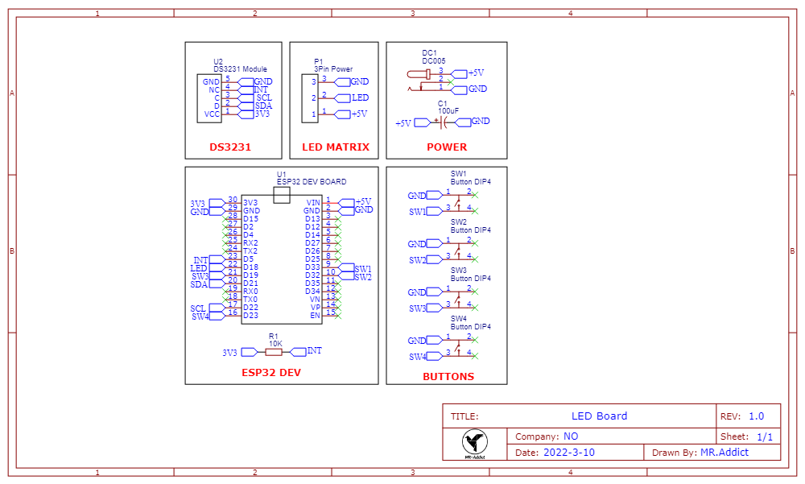
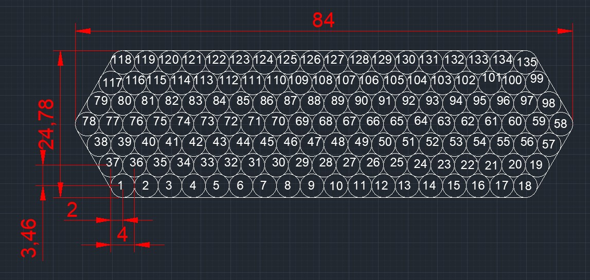
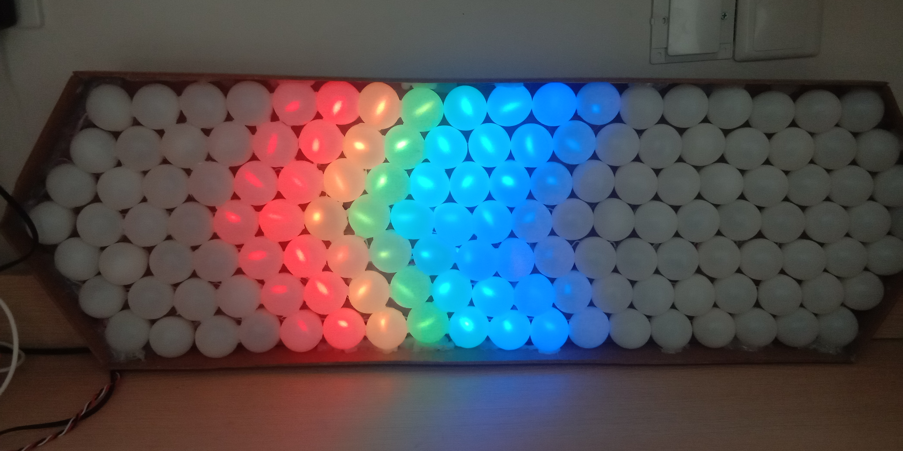
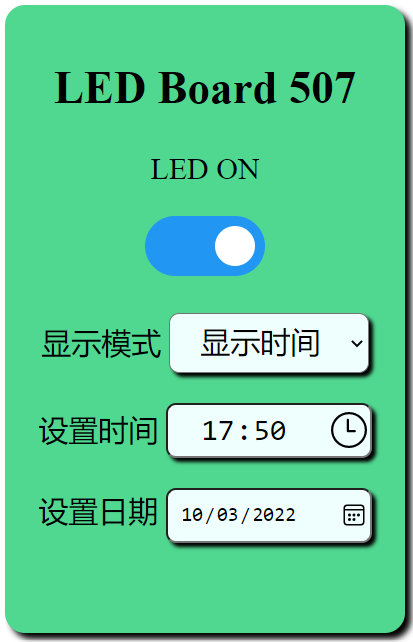

# WS2812-LED-Ping-Pong-Board

In this project, I use **Ping Pong Balls** to cover a wooden board, use MIT APP Invenotr to bulid a **custom android app**, and you can also contorl this board through **Web UI**.

The baord features built-in animated effects, time display, scrolling date display!

## 1. Components needed

### 1.1 Electronics

- **DC005** X 1
- **Button** X 4
- **WS2812LED** X 135
- **DS3231 Module** X 1
- **100uF Capaciter** X 1
- **ESP32 DEV Board** X 1
- **5V 3A Power Adapter** X 1

### 1.2 Other parts

- **Ping Pong Balls** X 135
- **24.78mm X 84mm Ply Board** X 1
- **Some Other Decoration Parts** X N

## 2. Assemble your LED Board

You should solder your comonents like below schematic:

But you can also send my [custom PCB](pcb/LED-Board-Gerber.zip) gerber files to PCB factory which is at `PCB/LED Board Gerber`.

Then, layout your ping pong balls like below:

The final project should be like this:

### 3. Contorl Your Board

There are three methods to control your LED board:

- Buttons
- Android App
- Web UI

### 3.1 Buttons

| Button  |        Function        |
| :-----: | :--------------------: |
| Button1 |    Turn LED ON/OFF     |
| Button2 | Set Background Palette |
| Button3 | Previous Display Mode  |
| Button4 |   Next Display Mode    |

### 3.3 Web UI

You can also contorl your board through WIFI.

Because this LED Board is put in our office, so I use **STAION** mode to let it connect to our office's router.

In order to easily access it, I change it's hostname to `ledboard`, so I can access it through http://ledboard.

This Web UI use websockets, so the board's data are Synchronized to all clients.

## 4. Preview Video

https://user-images.githubusercontent.com/75357598/121656129-bf379a80-cad1-11eb-9fc5-0b48965fc32e.mp4
